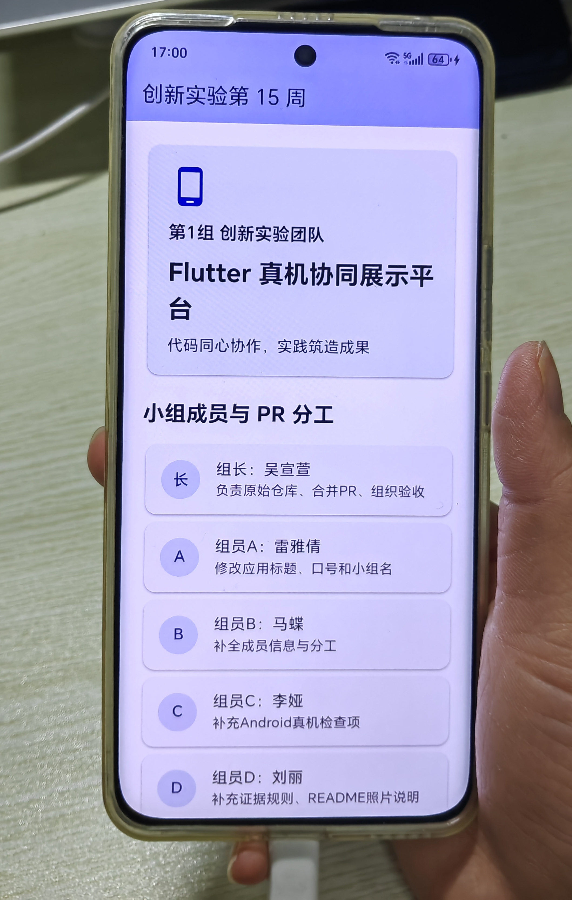

# 第 15 周创新实验成果

本项目用于第 15 周课堂任务：小组通过 Fork + Pull Request 协作修改同一个 Flutter 项目，并把最终版本运行到真实 Android 手机上。

## 小组成员

| 角色 | 姓名 | 任务 | PR 链接 |
| --- | --- | --- | --- |
| 组长 | 吴宣萱 | 创建仓库、审核并合并 PR、组织真机运行 | --- |
| 组员 A | 雷雅倩 | 修改小组名称、应用标题和项目口号 | https://github.com/xuanxuanwuhh/innovation-week15-team-device/pull/2 |
| 组员 B | 马蝶 | 补全成员信息与分工 | https://github.com/xuanxuanwuhh/innovation-week15-team-device/pull/1 |
| 组员 C | 李娅 | 补充 Android 真机运行检查项 | https://github.com/xuanxuanwuhh/innovation-week15-team-device/pull/3 |
| 组员 D | 刘丽 | 补充证据规则和 README 照片说明 | https://github.com/xuanxuanwuhh/innovation-week15-team-device/pull/4 |

## 协作流程

本周统一使用 Fork + Pull Request：

```text
组长创建原始仓库
  -> 组员 Fork 到自己的 GitHub
  -> 组员 clone 自己的 Fork
  -> 组员创建个人分支并修改指定区域
  -> 组员 push 到自己的 Fork
  -> 组员向组长仓库提交 Pull Request
  -> 组长 Review 并合并
  -> 主电脑运行合并后的最终版本
```

组员不要直接 push 到组长仓库的 `main` 分支。

## 运行命令

进入项目根目录后执行：

```bash
flutter pub get
flutter test
flutter run
```

如果电脑连接了多台设备，先查看设备：

```bash
adb devices
flutter devices
```

再指定真实 Android 手机运行：

```bash
flutter run -d 设备ID
```

## Android 真机运行

- 主电脑：华为MateBook D15 Windows11
- 手机型号：荣耀100
- 运行方式：`flutter run`
- 运行日期：2026年6月13日

连接手机后先检查：

```bash
adb devices
flutter devices
```

`adb devices` 的状态应该是：

```text
device
```

如果显示 `unauthorized`，请解锁手机，允许 USB 调试，重新插拔数据线后再执行 `adb devices`。

## 真机照片要求

请把照片放到：

```text
images/android-real-device.jpg
```

合格照片必须满足：

- 真实 Android 手机正在运行本小组 Flutter 应用；
- 不能是 Web 截图；
- 不能是 Android 模拟器截图；
- 不能用手机本机截图代替；
- 必须由第二部手机拍摄；
- 照片中能看到手持手机；
- 不包含聊天记录、手机号、定位等隐私信息。

## 本组真机运行照片

提交照片后，下面应显示本组运行效果：


